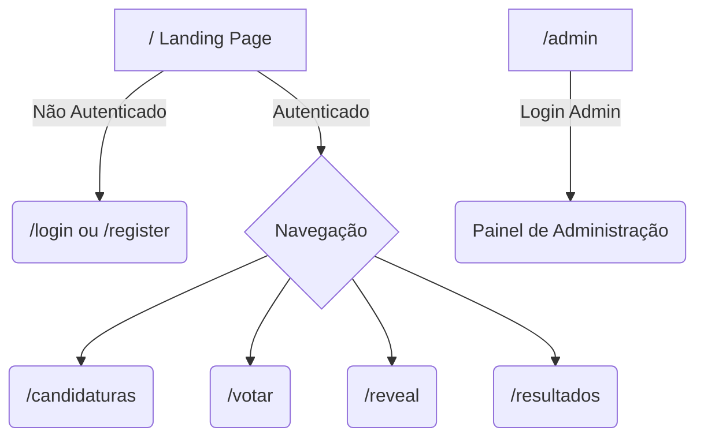

# 01 - Arquitetura

## Estrutura de Pastas do Monorepo

O projeto utilizará uma estrutura de monorepo, contendo tanto o frontend quanto o backend, facilitando o deploy em container único.

```text
/
├── backend/
│   ├── main.py              # Ponto de entrada do FastAPI
│   ├── api/                 # Rotas da API
│   ├── core/                # Configurações e segurança (JWT, envs)
│   ├── models/              # Modelos do SQLAlchemy
│   ├── schemas/             # Schemas do Pydantic
│   ├── crud/                # Operações de banco de dados
│   ├── database.py          # Configuração do SQLite
│   └── tests/               # Testes unitários (pytest)
├── frontend/
│   ├── public/              # Assets estáticos, modelos 3D (.glb)
│   ├── src/
│   │   ├── assets/          # Imagens, globais de CSS
│   │   ├── components/      # Componentes reutilizáveis (UI, 3D)
│   │   ├── pages/           # Telas (Landing, Login, Candidaturas, etc)
│   │   ├── hooks/           # Custom hooks (API, Auth)
│   │   ├── store/           # Gerenciamento de estado (se necessário)
│   │   └── App.jsx          # Configuração de rotas
│   ├── index.html
│   ├── package.json
│   ├── tailwind.config.js
│   └── vite.config.js
├── docs/                    # Documentação do projeto
├── Dockerfile               # Configuração do container único
├── requirements.txt         # Dependências do Python
└── .env                     # Variáveis de ambiente (não versionado)
```

## Fluxo de Build e Deploy (Container Único)

1. **Build do Frontend:** O Vite compila o React para arquivos estáticos (`frontend/dist`).
2. **Serviço Estático:** O FastAPI (Backend) é configurado para servir a pasta `frontend/dist` na rota raiz `/` e os arquivos estáticos nas rotas apropriadas, capturando rotas não-API para o `index.html` (para suporte ao React Router).
3. **Docker:** O `Dockerfile` realiza o build do frontend via Node, instala as dependências do Python, e roda o servidor Uvicorn expondo a porta. Tudo em um container único.

## Diagrama de Rotas/Telas


