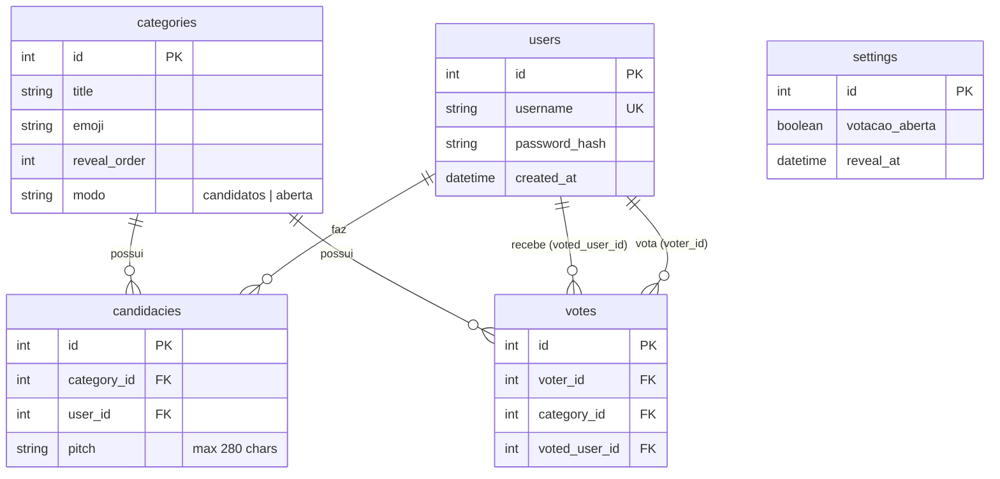

# 02 - Modelo de Dados

## Diagrama ER

## Tabelas e Constraints

### `users`
- `id`: INTEGER PRIMARY KEY
- `username`: VARCHAR UNIQUE NOT NULL
- `password_hash`: VARCHAR NOT NULL
- `created_at`: DATETIME DEFAULT CURRENT_TIMESTAMP

### `categories`
- `id`: INTEGER PRIMARY KEY
- `title`: VARCHAR NOT NULL
- `emoji`: VARCHAR NOT NULL
- `reveal_order`: INTEGER NOT NULL (Ordem de apresentação na cerimônia)
- `modo`: VARCHAR NOT NULL (Restrito a 'candidatos' ou 'aberta')

### `candidacies`
- `id`: INTEGER PRIMARY KEY
- `category_id`: INTEGER FOREIGN KEY (categories.id)
- `user_id`: INTEGER FOREIGN KEY (users.id)
- `pitch`: VARCHAR(280) NOT NULL
- **Constraints**: `UNIQUE(category_id, user_id)` — Limita 1 candidatura por categoria para cada usuário.

### `votes`
- `id`: INTEGER PRIMARY KEY
- `voter_id`: INTEGER FOREIGN KEY (users.id)
- `category_id`: INTEGER FOREIGN KEY (categories.id)
- `voted_user_id`: INTEGER FOREIGN KEY (users.id)
- **Constraints**: 
  - `UNIQUE(voter_id, category_id)` — Usuário só pode votar uma vez por categoria (se mudar, é upsert).
  - `CHECK(voter_id != voted_user_id)` — Bloqueio de auto-voto no banco.

### `settings`
*(Tabela de linha única para configurações globais)*
- `id`: INTEGER PRIMARY KEY (sempre 1)
- `votacao_aberta`: BOOLEAN NOT NULL DEFAULT TRUE
- `reveal_at`: DATETIME (Data/hora que o timer zera)
